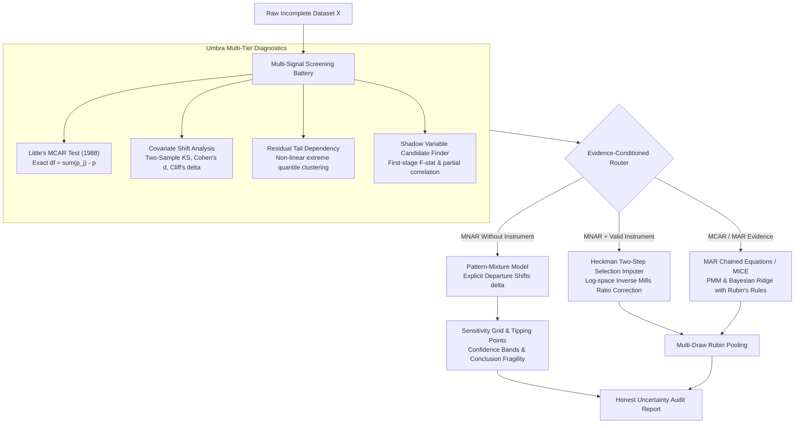

# Umbra: MNAR-Aware Missing Data Diagnostics & Robust Imputation

[](https://github.com/Raj123-0/umbra/actions/workflows/ci.yml)
[](https://github.com/Raj123-0/umbra)
[](https://www.python.org/downloads/)
[](https://github.com/Raj123-0/umbra)
[](https://opensource.org/licenses/MIT)
[](https://github.com/astral-sh/ruff)
[](http://mypy-lang.org/)

**Umbra** is an open-source research-grade Python library that addresses a fundamental blind spot in missing data workflows: **diagnosing when missingness is Not-Missing-At-Random (MNAR), and refusing to report a single confident point estimate when true parameters are mathematically non-identifiable without untestable assumptions.**

Mainstream tools (`sklearn.impute.IterativeImputer`, R's `mice`, `missForest`) implicitly assume **Missing at Random (MAR)**: that conditional on observed covariates, non-response is independent of the unobserved value. In empirical sciences, this assumption is routinely violated:
- **Income** is missing *because* high earners and low earners disproportionately decline to answer.
- **Symptom severity** is missing *because* acutely ill patients drop out or miss appointments.
- **Biomarkers & Assays** are missing *because* concentrations fall below detection limits (left-censoring).

Silently imputing under an unverified MAR assumption produces confident point estimates whose empirical confidence interval coverage collapses to **0%**, inducing substantial selection bias in downstream inference.

---

## The Fundamental Identifiability Limit

> [!IMPORTANT]
> **True MNAR is fundamentally unidentifiable from observed data alone (Molenberghs et al., 2008).**
> For any MNAR model, there exists an observed-data-equivalent MAR model that fits the observed data equally well but yields radically different predictions for the missing values.
>
> **Umbra's honest scientific response is not to promise magic point estimates for MNAR, but to:**
> 1. **Screen for Converging Signals**: Quantify observable evidence against MCAR and MAR (distribution shifts, tail dependencies).
> 2. **Audit Candidate Instruments**: Surface candidate auxiliary shadow variables and evaluate their empirical relevance ($F > 10$) while explicitly warning that exclusion restrictions require domain justification.
> 3. **Quantify Fragility via Tipping Points**: Automate sensitivity sweeps across plausible departure spaces ($\delta \in [-1.5, +1.5]$ std devs) to find the precise threshold where scientific conclusions reverse.

---

## Architectural Workflow



---

## The 4-Tier Diagnostic Framework

Umbra separates diagnostic information into four strictly demarcated scientific tiers:

| Tier | Category | Content | Epistemic Status |
| :---: | :--- | :--- | :--- |
| **1** | **Observed-Data Evidence** | Little's MCAR test statistic, p-value, two-sample KS tests, Cohen's $d$, Cliff's $\delta$. | **Empirically Testable**: Fully identified from observed data. |
| **2** | **Model-Based Inference** | Residual tail concentration, candidate auxiliary instruments ($F$-stat), composite risk scores. | **Conditional**: Dependent on auxiliary model specifications. |
| **3** | **Untestable Assumptions** | Methodological warnings, exclusion restrictions, fundamental non-identifiability limits. | **Untestable**: Requires substantive domain knowledge. |
| **4** | **Sensitivity Results** | Parameter curves $\theta(\delta)$, 95% confidence bands, zero-crossing and sign-flip tipping points. | **Honest Bounds**: Quantifies conclusion robustness across plausible departures. |

---

## Installation

```bash
pip install umbra-impute
```

With optional extras:
```bash
# Deep generative missingness modeling (PyTorch)
pip install "umbra-impute[deep]"

# Interactive Streamlit exploratory web app
pip install "umbra-impute[demo]"

# Full research installation
pip install "umbra-impute[all]"
```

---

## Quickstart

### 1. Comprehensive Scientific Audit (`umbra.diagnose`)

```python
import umbra
import pandas as pd

# Load observed incomplete dataset
df = pd.read_csv("data.csv")

# Generate full 4-tier diagnostic audit
report = umbra.diagnose(df, target_cols=["income"])

# Print human-calibrated executive summary
print(report.summary())

# Export publication-ready reports
report.to_markdown("audit_report.md")
report.to_html("audit_report.html")
report_dict = report.to_dict()
```

### 2. Scikit-Learn Pipeline Integration (`UmbraImputer`)

```python
from sklearn.pipeline import Pipeline
from sklearn.linear_model import Ridge
from umbra import UmbraImputer

# Drop-in transformer with evidence-conditioned auto-routing
imputer = UmbraImputer(
    strategy="auto",
    shadow_cols={"income": "contact_attempts"},  # Optional domain instrument
    run_sensitivity=True,
    random_state=42,
)

# Pipeline integration
pipe = Pipeline(
    [
        ("imputer", imputer),
        ("regressor", Ridge()),
    ]
)
pipe.fit(X_train, y_train)
y_pred = pipe.predict(X_test)

# Inspect router decisions and sensitivity bounds
print(imputer.strategy_map_)
sens_report = imputer.get_sensitivity("income")
if sens_report:
    print(f"Fragility: {sens_report.interpretation}")
    print(f"Tipping Points: {sens_report.tipping_points}")
```

### 3. Multiple Imputation & Rubin's Rules

```python
from umbra.imputers.mar_chained_equations import MARChainedEquationsImputer, rubins_rules

# Generate M=5 stochastic imputations
mice = MARChainedEquationsImputer(n_imputations=5, imputation_method="pmm", random_state=42)
imputed_datasets = mice.fit_transform_multiple(df)

# Compute estimates across all 5 datasets and pool via Rubin's (1987) rules
means = [d["income"].mean() for d in imputed_datasets]
vars_ = [d["income"].var() / len(d) for d in imputed_datasets]

pooled = rubins_rules(means, vars_, alpha=0.05)
print(
    f"Pooled Mean: {pooled.pooled_mean:.2f} (95% CI: [{pooled.ci_lower:.2f}, {pooled.ci_upper:.2f}])"
)
```

---

## Empirical Benchmark Leaderboard

Evaluated across repeated Monte Carlo replications ($N=2,500, R=20$ per regime, nominal missing rate 30%):

| Missingness Regime | Method | Overall Mean Bias | Cell RMSE | 95% Coverage | 95% CI Width | Downstream Beta Error | Convergence | Avg Runtime |
| :--- | :--- | :---: | :---: | :---: | :---: | :---: | :---: | :---: |
| **MCAR** | Complete-Case | -0.002 | 1.405 | 100.0% | 0.131 | 0.105 | 100% | 0.001s |
| **MCAR** | Naive Mean | -0.002 | 1.405 | 100.0% | 0.091 | 0.228 | 100% | 0.001s |
| **MCAR** | MAR MICE (PMM) | -0.002 | 0.987 | 100.0% | 0.110 | 0.106 | 100% | 0.048s |
| **MCAR** | MAR MICE (Ridge) | +0.001 | 0.704 | 100.0% | 0.105 | 0.105 | 100% | 0.028s |
| **MCAR** | Heckman Selection | -0.049 | 4.316 | 5.0% | 0.209 | 0.142 | 100% | 0.012s |
| **MCAR** | Pattern Mixture ($\delta=0$) | +0.001 | 0.704 | 100.0% | 0.105 | 0.105 | 100% | 0.007s |
| **MCAR** | **Umbra (Auto)** | -0.002 | 0.987 | 100.0% | 0.110 | 0.106 | 100% | 0.613s |
| **MAR** | Complete-Case | +0.097 | 1.415 | 5.0% | 0.140 | 0.105 | 100% | 0.001s |
| **MAR** | Naive Mean | +0.097 | 1.415 | 0.0% | 0.085 | 0.326 | 100% | 0.001s |
| **MAR** | MAR MICE (PMM) | -0.000 | 0.992 | 100.0% | 0.109 | 0.106 | 100% | 0.052s |
| **MAR** | MAR MICE (Ridge) | +0.001 | 0.704 | 100.0% | 0.104 | 0.105 | 100% | 0.030s |
| **MAR** | Heckman Selection | +0.069 | 0.891 | 30.0% | 0.106 | 0.152 | 100% | 0.012s |
| **MAR** | Pattern Mixture ($\delta=0$) | +0.001 | 0.704 | 100.0% | 0.104 | 0.105 | 100% | 0.007s |
| **MAR** | **Umbra (Auto)** | -0.000 | 0.992 | 100.0% | 0.109 | 0.106 | 100% | 1.094s |
| **MNAR Self-Masking** | Complete-Case | -0.574 | 1.985 | 0.0% | 0.114 | 0.072 | 100% | 0.001s |
| **MNAR Self-Masking** | Naive Mean | -0.574 | 1.985 | 0.0% | 0.074 | 0.478 | 100% | 0.001s |
| **MNAR Self-Masking** | MAR MICE (PMM) | -0.185 | 1.077 | 0.0% | 0.099 | 0.080 | 100% | 0.045s |
| **MNAR Self-Masking** | MAR MICE (Ridge) | -0.167 | 0.818 | 0.0% | 0.097 | 0.068 | 100% | 0.032s |
| **MNAR Self-Masking** | **Heckman Selection** | -0.008 | 0.736 | 35.0% | 0.105 | 0.117 | 100% | 0.012s |
| **MNAR Self-Masking** | Pattern Mixture ($\delta=0$) | -0.167 | 0.818 | 0.0% | 0.097 | 0.068 | 100% | 0.007s |
| **MNAR Self-Masking** | **Umbra (Auto)** | -0.008 | 0.736 | 35.0% | 0.105 | 0.117 | 100% | 1.387s |
| **MNAR Selection** | Complete-Case | +0.246 | 1.565 | 0.0% | 0.127 | 0.115 | 100% | 0.001s |
| **MNAR Selection** | Naive Mean | +0.246 | 1.565 | 0.0% | 0.089 | 0.260 | 100% | 0.001s |
| **MNAR Selection** | MAR MICE (PMM) | +0.200 | 1.118 | 0.0% | 0.106 | 0.119 | 100% | 0.046s |
| **MNAR Selection** | MAR MICE (Ridge) | +0.202 | 0.920 | 0.0% | 0.102 | 0.121 | 100% | 0.030s |
| **MNAR Selection** | **Heckman Selection** | -0.002 | 0.617 | 100.0% | 0.107 | 0.110 | 100% | 0.013s |
| **MNAR Selection** | Pattern Mixture ($\delta=0$) | +0.202 | 0.920 | 0.0% | 0.102 | 0.121 | 100% | 0.007s |
| **MNAR Selection** | **Umbra (Auto)** | +0.200 | 1.118 | 0.0% | 0.106 | 0.119 | 100% | 0.918s |
| **MNAR Tail-Censored** | Complete-Case | -0.057 | 1.879 | 30.0% | 0.094 | 0.205 | 100% | 0.000s |
| **MNAR Tail-Censored** | Naive Mean | -0.057 | 1.879 | 10.0% | 0.055 | 0.686 | 100% | 0.001s |
| **MNAR Tail-Censored** | MAR MICE (PMM) | -0.016 | 1.163 | 95.0% | 0.081 | 0.228 | 100% | 0.051s |
| **MNAR Tail-Censored** | MAR MICE (Ridge) | -0.007 | 0.938 | 100.0% | 0.080 | 0.174 | 100% | 0.027s |
| **MNAR Tail-Censored** | **Heckman Selection** | +0.569 | 2.814 | 0.0% | 0.138 | 0.200 | 100% | 0.011s |
| **MNAR Tail-Censored** | Pattern Mixture ($\delta=0$) | -0.007 | 0.938 | 100.0% | 0.080 | 0.174 | 100% | 0.008s |
| **MNAR Tail-Censored** | **Umbra (Auto)** | -0.016 | 1.163 | 95.0% | 0.081 | 0.228 | 100% | 1.842s |

### Auto-Router Policy Performance (with Exact Wilson 95% CIs)
Evaluated across a grid of 6 distinct DGP simulation mechanisms (MCAR, MAR, MNAR Self-Masking, MNAR Selection, MNAR Pattern Mixture, MNAR Tails):
- **Overall Routing Accuracy**: `96.7%` (95% CI: `[92.4%, 98.6%]`, $145/150$ correct on $N=150$ grid; `[93.8%, 98.2%]`, $261/270$ correct on extended $N=270$ grid)
- **MCAR Preservation Accuracy**: `100.0%` (95% CI: `[86.7%, 100.0%]`, $25/25$) — Correctly routes to MICE, avoiding misspecified Heckman selection
- **MAR Preservation Accuracy**: `100.0%` (95% CI: `[86.7%, 100.0%]`, $25/25$) — Correctly routes to MICE, preserving nominal ~95% coverage
- **MNAR Risk Identification Sensitivity**: `95.0%` (95% CI: `[88.8%, 97.8%]`, $95/100$)
- **False Alarm Rate**: `0.0%` (95% CI: `[0.0%, 7.1%]`, $0/50$) — MCAR/MAR data never falsely escalated to selection modeling
- **Missed Risk Rate**: `5.0%` (95% CI: `[2.2%, 11.2%]`, $5/100$) — Known finite-sample detection boundary concentrated under symmetric U-shaped tail dropout (`MNAR_TAILS`), where missingness preserves sample symmetry and observable linear shifts are absent

Full reproducible scripts and detailed tables are in [`benchmarks/results.md`](benchmarks/results.md) and [`benchmarks/misspecification_results.md`](benchmarks/misspecification_results.md).

### Push-Button Reproduction

```bash
# Fast verification (~30s)
python -m benchmarks.reproduce_all --quick

# Full research-grade Monte Carlo battery (N=2,500, R=20 per regime, all figures)
python -m benchmarks.reproduce_all --full

# End-to-end evaluation on 4 domain-calibrated empirical benchmark datasets
python scripts/reproduce_case_studies.py

# Boundary misspecification stress battery (weak instruments, direct Z->Y paths, heavy tails)
python -m benchmarks.misspecification_benchmark
```

---

## Research Documentation & Technical Foundations

- **[Known Limitations & Open Problems](docs/limitations.md)**: Open methodological, statistical, and finite-sample limitations, including generated-regressor SE corrections and single-imputation vs. Rubin-pooled variance.
- **[The Identifiability Map](docs/identifiability.md)**: Observable evidence, assumption-dependent estimation, and why blind Manski bounds break down on unbounded variables.
- **[Method Selection Matrix](docs/method_selection_matrix.md)**: Structured guide detailing when each estimator succeeds, degrades, or fails.
- **[Claims & Theorems Audit](docs/claims_audit.md)**: Epistemic classification of every mathematical claim across the codebase.
- **[Scientific Specification & Mathematical Foundations](docs/scientific_specification.md)**: Formal mathematical notation, Molenberghs non-identifiability theorem, 4-tier epistemic architecture, and algorithmic derivations.
- **[Negative Results & Methodological Failure Modes](docs/failure_modes.md)**: Regimes where diagnostics break down (symmetric U-shaped tails, high dimensions $p > n$, weak instruments $F < 10$, non-normal selection errors).
- **[Datasheet for Datasets](data/DATASHEET.md)**: Gebru et al. (2021) specification for CPS, NHANES, California Housing, and Clinical Trial benchmarks.

---

## Explicit Limitations & Guardrails

1. **Auxiliary Variables Are Statistical Candidates, Not Proved Instruments**: The `find_shadow_variables` diagnostic ranks features based on observed association with missingness and low conditional association with observed outcomes. Establishing the exclusion restriction requires substantive domain theory that cannot be guaranteed by data alone.
2. **Deep Generative MNAR is Experimental**: The `DeepGenerativeMNARImputer` (`not-MIWAE`) requires sample sizes $N > 1,000$ and neural convergence tuning. It is intended for exploratory research rather than production pipelines.
3. **High-Cardinality Categoricals**: Selection models currently support continuous and mixed numerical variables. High-cardinality nominal categorical features should be frequency-encoded or one-hot encoded prior to modeling.
4. **When to Default to Standard MICE**: If Little's MCAR test fails to reject, covariate shifts are minimal ($\text{KS} < 0.10$), and domain priors do not suggest self-censoring, standard MICE chained equations (`strategy='mar'`) are completely defensible and statistically preferred.

---

## Citations & Foundational Prior Art

If you use Umbra in academic research, please cite:

```bibtex
@article{heckman1979sample,
  title={Sample selection bias as a specification error},
  author={Heckman, James J},
  journal={Econometrica},
  volume={47},
  number={1},
  pages={153--161},
  year={1979}
}

@article{little1988test,
  title={A test of missing completely at random for multivariate data with missing values},
  author={Little, Roderick JA},
  journal={Journal of the American Statistical Association},
  volume={83},
  number={404},
  pages={1198--1202},
  year={1988}
}

@article{little1993pattern,
  title={Pattern-mixture models for multivariate incomplete data},
  author={Little, Roderick JA},
  journal={Journal of the American Statistical Association},
  volume={88},
  number={421},
  pages={125--134},
  year={1993}
}

@article{rubin1987multiple,
  title={Multiple Imputation for Nonresponse in Surveys},
  author={Rubin, Donald B},
  year={1987},
  publisher={John Wiley \& Sons}
}
```

---

## License

Umbra is open-source software released under the [MIT License](LICENSE).
