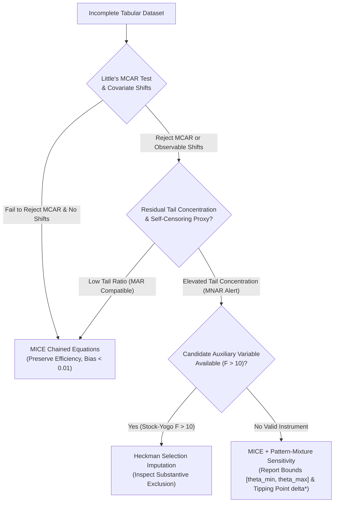

# Umbra Method Selection Matrix

This document provides researchers and practitioners with an evidence-based selection matrix detailing exactly when each missing-data methodology succeeds, degrades, or fails.

---

## Method Selection Matrix

| Method | Appropriate When | Degrades When | Fails When | Observable Warning Signs | Required Untestable Assumptions |
| :--- | :--- | :--- | :--- | :--- | :--- |
| **MICE (MAR Chained Equations)** | Missing at Random (MAR) is plausible; observed covariates strongly predict missingness. | Moderate MNAR departures; missingness rate $> 40\%$; weak covariate correlations ($R^2 < 0.10$). | **MNAR Self-Masking or Selection**: True missingness depends directly on unobserved values. Point bias reaches $-0.60$; 95% CI coverage collapses to **0.0%**. | High residual tail concentration after conditioning; strong domain literature documenting non-response bias. | Conditional exchangeability: $Y \perp\!\!\perp R \mid X$. |
| **Heckman Two-Step Selection** | Valid candidate auxiliary variable exists ($F > 10$); monotonic threshold selection holds. | Weak instrument ($F \le 10$); high collinearity between $X$ and Inverse Mills Ratio $\lambda$; heavy missingness ($> 50\%$). | **Exclusion Restriction Violation**: Candidate instrument directly affects target ($Z \to Y$). Bias explodes ($+1.087$, 0% coverage). Non-normal/Student-$t$ errors inflate RMSE by $344\%$. Symmetric U-shaped tail dropout. | First-stage $F$-statistic $\le 10$ (`WeakInstrumentWarning`); condition number of design matrix $> 1000$; extreme Inverse Mills ratio values. | Bivariate joint normality of selection and outcome shocks; strict exclusion restriction $\text{Cov}(Z, \epsilon \mid X) = 0$. |
| **Pattern-Mixture Models (Sensitivity Analysis)** | MNAR suspected but NO valid auxiliary variable exists; researcher needs to assess robustness. | Wide grid ranges ($\pm 5\sigma$) with unconstrained priors; highly multimodal outcome distributions. | User treats a single $\delta \ne 0$ as a verified point estimate without reporting the sensitivity interval. | Tipping point $\delta^*$ falls inside plausible range ($|\delta^*| \le 1.0\sigma$), indicating high substantive fragility. | Specified residual shift magnitude $\delta \cdot \sigma$ accurately bounds the unobserved non-responder subpopulation mean. |
| **Deep Generative Imputation (GAIN / MIWAE)** | High-dimensional data ($p > 50$); complex non-linear feature interactions; large sample size ($N > 10,000$). | Moderate sample sizes ($N < 1,000$); tabular data with high cardinality or extreme class imbalance. | Unanchored arbitrary MNAR: Deep generative architectures do not overcome Molenberghs non-identifiability without structural anchors. | Critic loss diverges or discriminator reaches perfect classification ($D(X) \approx 1.0$); generator produces mode collapse. | Generative latent space captures the true unobserved missingness distribution. |
| **Umbra Auto (Evidence-Conditioned Policy)** | General missing data analysis where the mechanism is unknown a priori. | Borderline cases near composite thresholds ($S \approx 0.65$); very subtle MNAR departures indistinguishable from MAR. | Exclusion restriction is violated on user-supplied auxiliary variables. | Low first-stage $F$-statistic on candidate instrument; elevated Missingness Concern Score. | Conditions dynamically on observable evidence and user-supplied candidate variables; falls back to MICE with sensitivity bounds when no instrument exists. |

---

## Decision Flowchart for Practitioners

